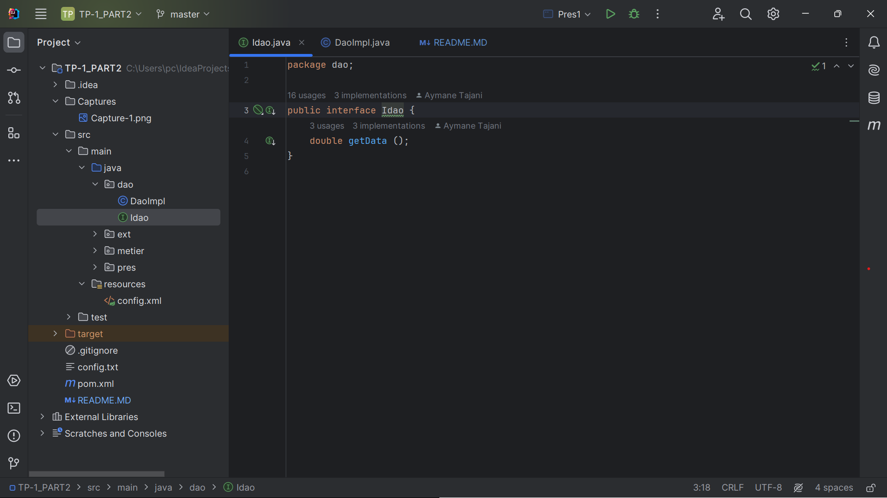
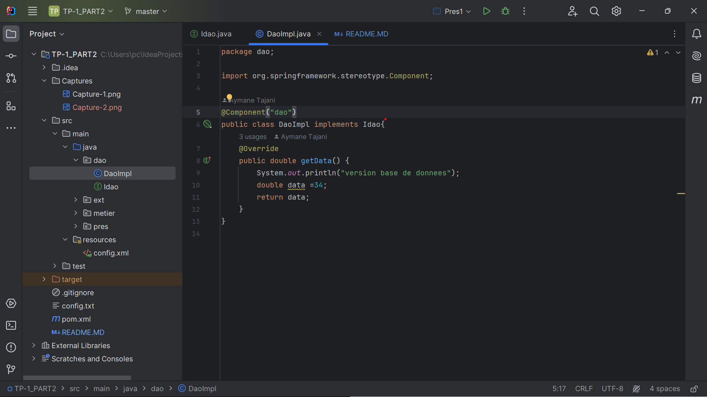
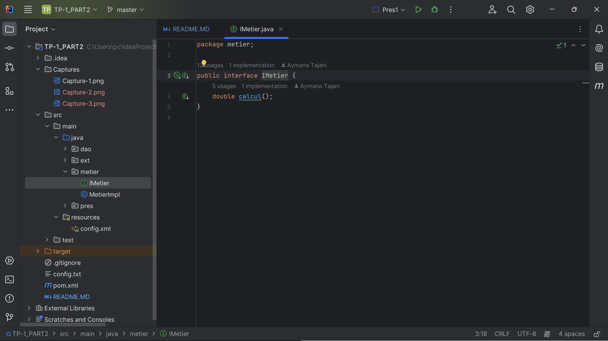
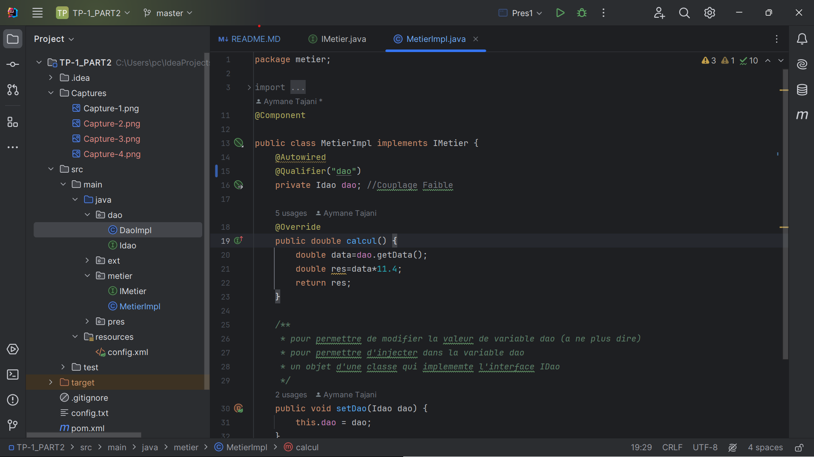
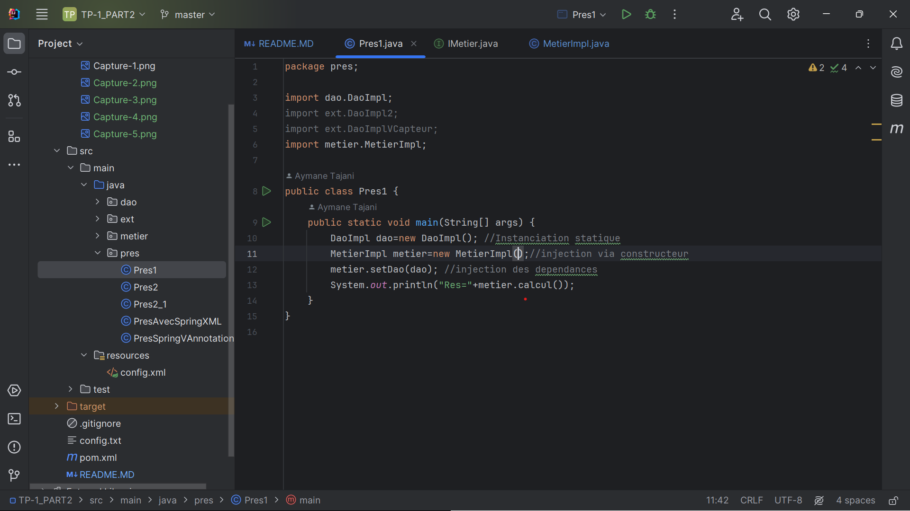
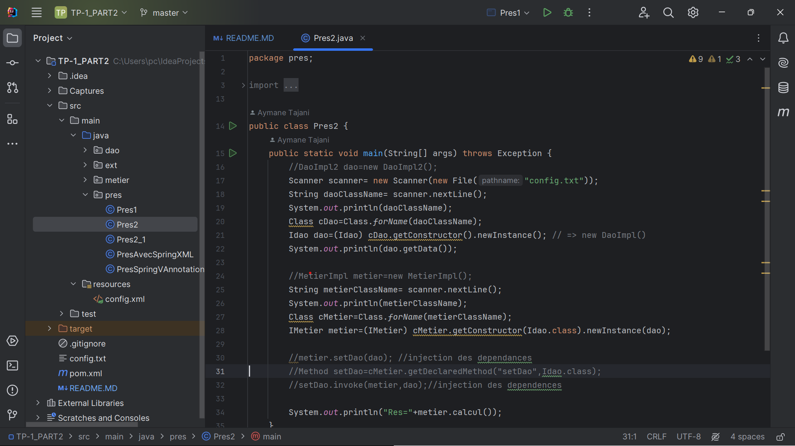
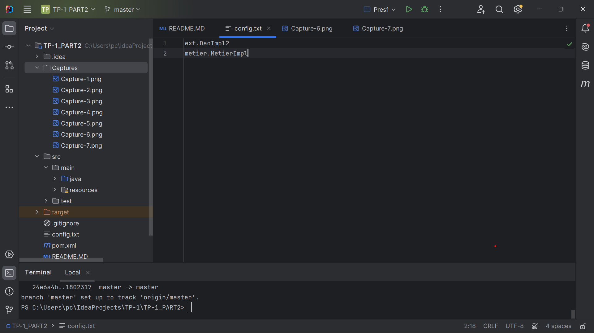
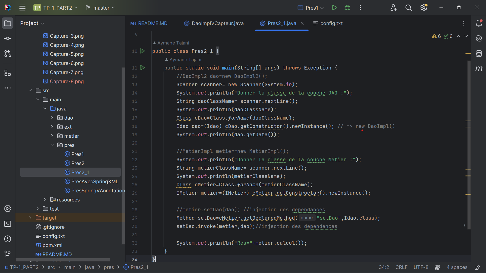
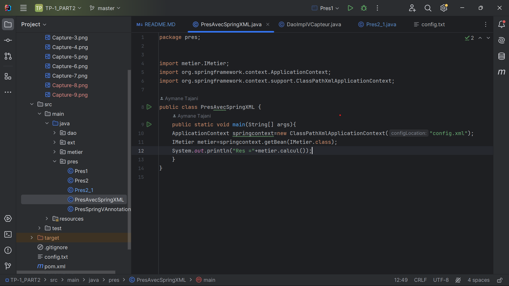
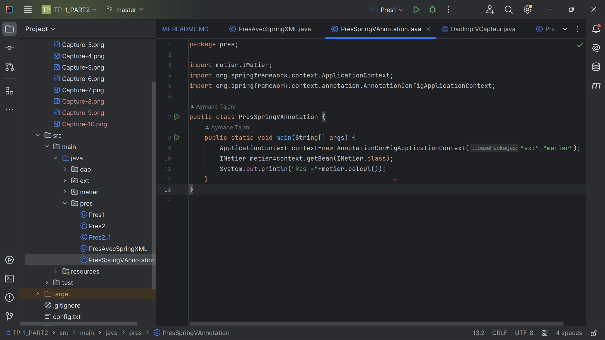

<h3>COMPTE RENDU</h3>
<h2>Structure du projet</h2>

<h2>Création de l'interface IDao avec une méthode getDate</h2>

<h2>Création d'une implémentation pour l'interface IDao</h2>

<h2>Création de l'interface IMetier avec une méthode calcul</h2>

<h2>Création d'une implémentation pour l'interface IMetier en utilisant le couplage faible</h2>

<h2>Faire l'injection des dépendances</h2>
<h1>Par une instanciation statique</h1>

<h1>Par une instanciation dynamique</h1>

<h1>Le fichier.txt</h1>

<h1>Par une instanciation dynamique(entrer a partir du clavier)</h1>

<h1> En utilisant le Framework Spring</h1>

Version XML

 Version annotations

